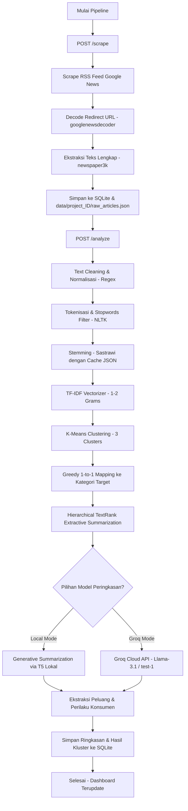

# Dokumentasi Teknis & Alur Kerja Aplikasi TrendAI Dashboard

Dokumen ini menjelaskan secara teknis mengenai arsitektur backend, skema database, integrasi model AI, dan alur kerja (workflow) pengolahan data otomatis pada aplikasi **TrendAI** (yang berpusat di folder [dashboard_app](file:///mnt/e/Digistar%20Class%20Intern/trend-summarization/dashboard_app)).

---

## 1. Gambaran Umum Teknis
Aplikasi **TrendAI** merupakan sistem SaaS berbasis lokal yang dirancang dengan arsitektur **decoupled client-server**:
*   **Backend REST API:** Menggunakan [FastAPI](https://fastapi.tiangolo.com/) untuk menyajikan endpoint API berkinerja tinggi serta mengorkestrasikan tugas latar belakang (asynchronous background tasks) menggunakan mekanisme `BackgroundTasks` bawaan FastAPI.
*   **Frontend Client:** Berupa aplikasi Single Page Application (SPA) hibrida berbasis halaman statis (HTML/JS/CSS) yang dilayani oleh server FastAPI melalui `StaticFiles` mounting.
*   **Database Relasional:** Menggunakan **SQLite** (`app_database.db`) untuk mencatat metadata proyek, menyimpan artikel hasil scraping, menyimpan agregasi tren, serta melacak feedback pengguna.
*   **AI/NLP Engine:** Pipa pengolahan teks gabungan dari KMeans Clustering, TextRank PageRank, dan model summarization generatif (T5 lokal atau cloud API Groq).

---

## 2. Arsitektur REST API & Integrasi Endpoint
FastAPI backend melayani komunikasi data client-server melalui endpoint terstruktur berikut:

```
[Client Frontend]
       │
       ▼ (HTTP REST API)
┌────────────────────────────────────────────────────────┐
│                     FastAPI Server                     │
│  ┌─────────────────────────┐  ┌─────────────────────┐  │
│  │   Pipeline Controllers  │  │  Data CRUD Routers  │  │
│  └───────────┬─────────────┘  └──────────┬──────────┘  │
│              │ (async tasks)             │             │
│              ▼                           ▼             │
│   ┌─────────────────────┐       ┌───────────────────┐  │
│   │  Background Workers │       │ Database Helper   │  │
│   └──────────┬──────────┘       └────────┬──────────┘  │
└──────────────┼───────────────────────────┼─────────────┘
               │                           │
               ▼                           ▼
      ┌──────────────────┐        ┌──────────────────┐
      │   AI Engine &    │        │  SQLite Database │
      │  Scraper Modules │        │ (app_database.db)│
      └──────────────────┘        └──────────────────┘
```

### A. Endpoint Manajemen Proyek (Project CRUD)
*   `POST /api/projects`
    *   **Payload:** `{ name: str, description: str, keywords: List[str] }`
    *   **Deskripsi:** Membuat baris baru pada database proyek pemantauan tren. Status awal diatur sebagai `draft`.
*   `GET /api/projects`
    *   **Deskripsi:** Mengambil daftar seluruh proyek yang terdaftar di database secara descending berdasarkan waktu pembuatan.
*   `GET /api/projects/{project_id}`
    *   **Deskripsi:** Mengambil metadata proyek spesifik serta menghitung total artikel yang terasosiasi dengannya.
*   `DELETE /api/projects/{project_id}`
    *   **Deskripsi:** Menghapus proyek beserta seluruh data artikel, ringkasan, dan feedback terkait (cascade delete) dan menghapus folder data proyek secara fisik dari disk.

### B. Endpoint Pipeline Data & Monitoring
*   `POST /api/projects/{project_id}/scrape`
    *   **Payload:** `{ limit_per_query: int, time_range: str }`
    *   **Deskripsi:** Menginisialisasi tugas latar belakang `execute_scrape_task` untuk melakukan penarikan berita.
*   `POST /api/projects/{project_id}/analyze`
    *   **Payload:** `{ model_source: str, groq_api_key: Optional[str], groq_model: Optional[str], start_date: Optional[str], end_date: Optional[str] }`
    *   **Deskripsi:** Menginisialisasi tugas latar belakang `execute_analyze_task` untuk preprocessing, clustering, dan summarization.
*   `GET /api/projects/{project_id}/logs`
    *   **Deskripsi:** Mengambil log konsol eksekusi pipa data secara real-time dari memori backend (`PIPELINE_LOGS`).

### C. Endpoint Pengambilan Data & Feedback
*   `GET /api/projects/{project_id}/trends?period={period}`
    *   **Deskripsi:** Mengambil hasil analisis tren proyek (ringkasan, kata kunci utama, peluang pasar, perilaku konsumen, dan artikel pendukung) per kategori tren.
*   `GET /api/projects/{project_id}/periods`
    *   **Deskripsi:** Mengambil daftar seluruh rentang periode mingguan analisis yang pernah dijalankan.
*   `GET /api/projects/{project_id}/articles?limit={N}&search={query}&category={cat}`
    *   **Deskripsi:** Mengambil daftar artikel terindeks dengan filter pencarian dan pagination.
*   `GET /api/projects/{project_id}/articles/{article_id}`
    *   **Deskripsi:** Mengambil teks penuh (raw text) dan teks bersih (cleaned text) dari suatu artikel spesifik.
*   `POST /api/projects/{project_id}/feedback`
    *   **Payload:** `{ trend_category: str, rating: str, comment: str }`
    *   **Deskripsi:** Menyimpan feedback kualitatif/kuantitatif dari pengguna ke database.
*   `GET /api/projects/{project_id}/feedback`
    *   **Deskripsi:** Mengambil riwayat feedback yang tersimpan untuk proyek terpilih.

---

## 3. Alur Kerja Data & Pipeline AI (Data Pipeline & AI Workflow)
Proses pengolahan data dikelompokkan ke dalam empat tahapan logis utama:



### Tahap 1: Pengumpulan & Penarikan Data (Scraping)
1.  Backend membaca kata kunci (keywords) proyek dari database SQLite.
2.  Backend mengirim permintaan pencarian ke Google News RSS Feed. Parameter rentang waktu terbit berita dikirimkan dengan sintaks Google: `[keyword] when:1d` atau `when:7d` jika ditentukan.
3.  Hasil feed diproses menggunakan `feedparser` untuk memperoleh metadata dasar (judul berita, tautan redirect Google, portal media, tanggal publikasi).
4.  Redirect URL Google News didekode secara langsung menggunakan library `googlenewsdecoder` untuk mendapatkan URL langsung halaman berita asli.
5.  Backend memanggil pustaka `newspaper3k` untuk mengunduh HTML halaman asli dan mengekstrak teks berita bersih (`raw_text`).
6.  Semua artikel berita baru disimpan ke dalam berkas lokal [data/project_<id>/raw_articles.json](file:///mnt/e/Digistar%20Class%20Intern/trend-summarization/dashboard_app/data) dan diunggah ke database SQLite.

### Tahap 2: Pra-Pemrosesan Teks (Preprocessing)
1.  **Text Cleaning:** Backend menggunakan modul ekspresi reguler (Regex) untuk membuang tag HTML, URL, email, angka, karakter khusus, dan emoji dari teks mentah.
2.  **Tokenisasi:** Token kata dipecah menggunakan tokenizer `nltk.word_tokenize`.
3.  **Stopword Removal:** Kata-kata umum dibuang menggunakan kamus bawaan `NLTK` untuk Bahasa Indonesia, Bahasa Inggris, dan daftar kata henti kustom (custom stopwords).
4.  **Stemming:** Token kata diubah menjadi kata dasarnya menggunakan `Sastrawi Stemmer`. Guna menghindari bottleneck kinerja akibat lambatnya pustaka Sastrawi, backend menggunakan **Stem Cache** berbasis file JSON [data/stem_cache.json](file:///mnt/e/Digistar%20Class%20Intern/trend-summarization/data/stem_cache.json). Jika kata tersebut pernah di-stem sebelumnya, hasilnya langsung diambil dari cache.
5.  Hasil disimpan dalam format `clean_text` dan daftar `clean_tokens` ke file `preprocessed_articles.json`.

### Tahap 3: Pemodelan Topik & Pengelompokan Tren (Clustering)
1.  Teks bersih (`clean_text`) diubah menjadi representasi numerik menggunakan `TfidfVectorizer` (mencakup n-gram 1 dan 2 untuk menangkap konteks frase penting).
2.  Algoritma `KMeans` dari `Scikit-Learn` dijalankan dengan parameter `n_clusters=3` untuk mengelompokkan berita ke dalam 3 kluster.
3.  **Greedy Mapping:** Pemetaan kluster ke kategori tren target (`Sustainability`, `Digital Marketing`, `Consumer Behavior Shift`) dilakukan secara otomatis menggunakan pencocokan kesamaan (similarity matching) antara bobot kata pada centroid kluster terhadap daftar kata referensi target (`REFERENCE_KEYWORDS`). Pasangan dengan skor kesamaan tertinggi akan dicocokkan terlebih dahulu secara 1-to-1.
4.  Kata kunci kategori dan kata kunci artikel diekstrak menggunakan bobot nilai TF-IDF dokumen.
5.  Hasil disimpan ke file `clustered_articles.json`.

### Tahap 4: AI Summarization & Insight Generation
1.  Berita dikelompokkan berdasarkan kategori tren yang dihasilkan kluster.
2.  **TextRank (PageRank) Extractive Summary:** Menggunakan pustaka `NetworkX` untuk menghitung PageRank pada matriks cosine similarity kalimat di dalam kluster.
    *   *Hierarchical Filtering:* Guna mencegah beban memori berlebih, sistem mengambil 2 kalimat teratas dari setiap artikel terlebih dahulu, lalu menggabungkannya, dan melakukan penyaringan TextRank ulang untuk mendapatkan **5 kalimat final paling representatif**.
3.  **Generative Summarization:**
    *   **Local Mode:** Memakai model Sequence-to-Sequence lokal Hugging Face `cahya/t5-base-indonesian-summarization-cased` untuk menulis ulang 5 kalimat representatif menjadi ringkasan eksekutif satu paragraf.
    *   **Groq API Mode:** Mengirimkan 5 kalimat representatif ke Groq Cloud API (menggunakan model `llama-3.1-8b-instant` atau model server `test-1`) untuk meminta respons JSON terstruktur berisi:
        *   `generative_brief`: Narasi ringkasan eksekutif berstruktur 4 poin (Tren Utama, Ringkasan, Sentimen Pasar, Rekomendasi).
        *   `market_opportunities`: Judul dan penjelasan peluang pasar baru berdasarkan data berita.
        *   `consumer_behavior`: Judul dan deskripsi pergeseran perilaku konsumen.
4.  Hasil disimpan ke file `final_summary_report.json` dan ditulis ke database SQLite (tabel `summaries`).

---

## 4. Desain & Skema Database SQLite
Database disimpan di file lokal [app_database.db](file:///mnt/e/Digistar%20Class%20Intern/trend-summarization/dashboard_app/data). Skema database didefinisikan di berkas [database.py](file:///mnt/e/Digistar%20Class%20Intern/trend-summarization/dashboard_app/database.py) dengan struktur sebagai berikut:

```
┌────────────────────────────────────────────────────────┐
│                        projects                        │
├────────────────────────────────────────────────────────┤
│ id           : INTEGER PRIMARY KEY AUTOINCREMENT       │
│ name         : TEXT NOT NULL (Unique)                  │
│ description  : TEXT                                    │
│ keywords     : TEXT NOT NULL (JSON string list)        │
│ status       : TEXT NOT NULL DEFAULT 'draft'           │
│ error_message: TEXT                                    │
│ created_at   : TEXT NOT NULL                           │
│ last_run_at  : TEXT                                    │
└──────────────────────────┬─────────────────────────────┘
                           │
             ┌─────────────┴─────────────┐
             ▼ (1:N, ON DELETE CASCADE)  ▼ (1:N, ON DELETE CASCADE)
┌──────────────────────────────────────┐┌──────────────────────────────────────┐
│               articles               ││              summaries               │
├──────────────────────────────────────┤├──────────────────────────────────────┤
│ id             : INTEGER PRIMARY KEY ││ id             : INTEGER PRIMARY KEY │
│ project_id     : INTEGER (FK)        ││ project_id     : INTEGER (FK)        │
│ title          : TEXT NOT NULL       ││ trend_category : TEXT NOT NULL       │
│ url            : TEXT                ││ article_count  : INTEGER DEFAULT 0   │
│ source         : TEXT                ││ top_keywords   : TEXT (JSON list)    │
│ publish_date   : TEXT                ││ extractive_brief: TEXT               │
│ raw_text       : TEXT                ││ generative_brief: TEXT               │
│ clean_text     : TEXT                ││ market_opportunities: TEXT (JSON)   │
│ trend_category : TEXT                ││ consumer_behavior: TEXT (JSON)       │
│ cluster_id     : INTEGER             ││ analysis_period: TEXT DEFAULT 'all'  │
│ keywords       : TEXT (JSON list)    │└──────────────────────────────────────┘
│ analysis_period: TEXT DEFAULT 'all'  │
└──────────────────────────────────────┘
             ▲
             │ (1:N, ON DELETE CASCADE)
┌────────────┴─────────────────────────┐
│              feedbacks               │
├──────────────────────────────────────┤
│ id             : INTEGER PRIMARY KEY │
│ project_id     : INTEGER (FK)        │
│ trend_category : TEXT NOT NULL       │
│ rating         : TEXT NOT NULL       │
│ comment        : TEXT                │
│ created_at     : TEXT NOT NULL       │
└──────────────────────────────────────┘
```

*   **Migrasi Data:** Fungsi `init_db()` secara otomatis melakukan inisialisasi tabel di atas, serta menjalankan skrip migrasi `ALTER TABLE` secara terprogram untuk menjamin kompatibilitas kolom `analysis_period` pada database yang sudah ada.

---

## 5. Penjadwal Otomatis (Weekly Scheduler)
Aplikasi menyertakan *scheduler* asinkronus otomatis yang berjalan di server backend:
*   **Mekanisme:** Pipa thread asinkronus (`run_weekly_scheduler`) berjalan terus-menerus dan memeriksa status waktu setiap **1 jam**.
*   **Logika Pemicu:**
    1.  Jika hari saat ini adalah hari **Minggu** (weekday 6), sistem menghitung tanggal Senin hingga Minggu minggu tersebut sebagai range periode aktif.
    2.  Backend mencari seluruh proyek aktif yang sedang tidak sibuk (status bukan `scraping` atau `processing`).
    3.  Backend memeriksa apakah periode mingguan tersebut sudah memiliki riwayat analisis di database.
    4.  Jika belum ada, sistem secara asinkronus memicu `execute_analyze_task` untuk menyaring berita seminggu terakhir dan memperbarui ringkasan tren proyek.

---

## 6. Pengaturan Keamanan & Header Middleware
FastAPI dikonfigurasikan dengan lapisan keamanan ketat untuk menahan celah eksploitasi web umum (seperti Clickjacking, XSS, MIME Sniffing):
*   **CORS Policy:** Membatasi asal domain (origins) hanya pada domain pengembangan lokal terdaftar (`localhost`, `127.0.0.1` di port `3000`, `5173`, `8001`) serta domain Hugging Face Spaces (`SPACE_HOST`) jika aplikasi di-deploy di cloud Spaces.
*   **X-Content-Type-Options:** Diatur ke `nosniff` untuk menghindari sniffing konten MIME tipe berkas.
*   **X-Frame-Options:** Diatur ke `SAMEORIGIN` secara default. Nilai ini diabaikan secara dinamis jika berjalan di lingkungan Hugging Face Spaces agar Gradio dapat memuat antarmuka dashboard ke dalam iframe secara aman.
*   **Content-Security-Policy (CSP):** Membatasi pemuatan skrip, style, font, dan koneksi eksternal hanya dari sumber tepercaya (CDN Tailwind, Google Fonts, dan domain internal aplikasi).
