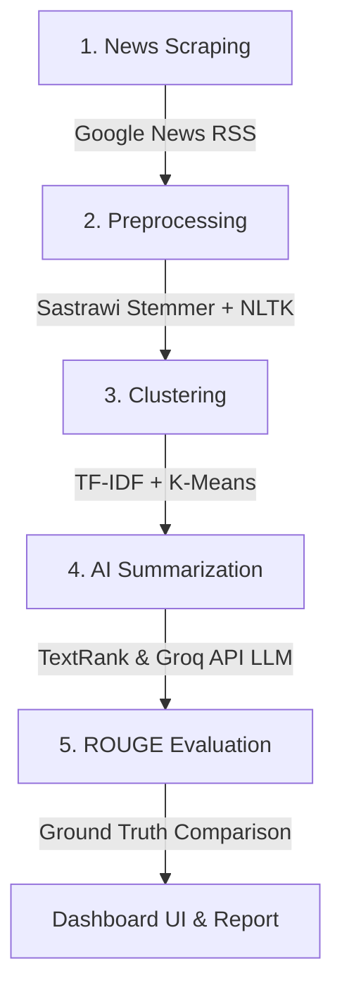

# Trend Summarizer AI

**Trend Summarizer AI** adalah platform terintegrasi untuk mengumpulkan, membersihkan, mengelompokkan, dan merangkum berita industri retail/FMCG secara real-time di Indonesia. Sistem ini dilengkapi dengan dashboard berbasis web untuk visualisasi tren serta modul evaluasi otomatis berbasis metrik **ROUGE** untuk membandingkan performa ringkasan AI dengan acuan manusia (*Ground Truth*).

---

## 📈 Alur Kerja Pipeline (Workflow)

Pipeline sistem ini berjalan secara end-to-end melalui 5 tahapan utama:



1. **Scraping Berita:** Menarik artikel berita terkini menggunakan RSS feed Google News berdasarkan kueri pencarian retail/FMCG. URL rujukan didekode secara otomatis ke tautan langsung artikel sumber untuk kemudian diunduh konten teks lengkapnya menggunakan pustaka `Newspaper3k`.
2. **Preprocessing (Pembersihan Teks):** Membersihkan dokumen mentah dari tag HTML, URL, email, karakter khusus, dan angka. Selanjutnya teks ditokenisasi, dieliminasi dari stopwords bahasa Indonesia, dan distemming secara efisien menggunakan cache global Sastrawi Stemmer.
3. **Topic Modeling & Clustering:** Merepresentasikan artikel preprocessed ke dalam bentuk matriks TF-IDF (Unigram & Bigram). Dokumen kemudian dikelompokkan ke dalam klaster tren menggunakan algoritma **K-Means**, dan dicocokkan dengan **10 kategori acuan utama** berdasarkan tingkat kesamaan kosinus (*Cosine Similarity*).
4. **AI Summarization (Peringkasan AI):** Menghasilkan 2 versi ringkasan untuk setiap klaster aktif:
   - **Extractive Summary:** Mengambil kalimat-kalimat penting langsung secara verbatim menggunakan algoritma TextRank.
   - **Generative Summary:** Menulis ulang informasi secara naratif dan terstruktur dalam format 4 poin utama (*Tren Utama*, *Ringkasan*, *Sentimen Pasar*, dan *Rekomendasi*) menggunakan **Groq API Cloud** (LLM Llama 3) atau model **T5 Lokal** secara offline.
5. **ROUGE Evaluation (Evaluasi Model):** Mengukur akurasi ringkasan (Extractive vs Generative) terhadap Ground Truth buatan manusia menggunakan metrik **ROUGE-1** (unigram), **ROUGE-2** (bigram), dan **ROUGE-L** (Longest Common Subsequence).

---

## 📁 Struktur Direktori Proyek

Berikut adalah detail isi folder di dalam repositori proyek:

* **`src/`**: Direktori utama kode sumber pipeline pemrosesan data.
  * `scraper/`: Modul penarikan berita real-time dari Google News.
  * `preprocessing/`: Modul tokenisasi, eliminasi stopword, dan stemming bahasa Indonesia.
  * `modeling/`: Modul klasterisasi dokumen (K-Means + TF-IDF) dan klasifikasi ke 10 kategori tren.
  * `summarizer/`: Mesin pembuat ringkasan AI (Extractive TextRank & Generative Groq API/T5).
  * `evaluation/`: Modul penghitungan skor evaluasi ROUGE.
* **`dashboard_app/`**: Aplikasi dashboard visualisasi berbasis FastAPI.
  * `main.py`: REST API backend untuk mengelola project, memicu pipeline, dan menyajikan data evaluasi.
  * `database.py`: Manajer database SQLite lokal.
  * `static/`: Antarmuka web frontend (HTML, CSS, JS) menggunakan Tailwind CSS dan Google Material Symbols.
* **`evaluation/`**: Data ground truth referensi manusia dan evaluator.
  * `ground_truth.json`: Menyimpan 10 ringkasan terstruktur buatan manusia sebagai standar acuan akurasi.
  * `evaluator.py`: Kelas inti untuk penghitungan presisi, recall, dan fmeasure dari ROUGE.
* **`data/`**: Direktori penyimpanan hasil keluaran pipeline proyek (raw, preprocessed, clustered, final summaries, dan SQLite DB).
* **`run_pipeline.ipynb`**: Notebook Jupyter yang mengintegrasikan dan mengeksekusi seluruh pipeline secara end-to-end dari scraping hingga evaluasi ROUGE.

---

## 📊 Hasil Evaluasi Model

Berdasarkan pengujian pipeline menggunakan Groq API model (`llama-3.1-8b-instant`/`test-1`) terhadap Ground Truth terstruktur, diperoleh hasil evaluasi ROUGE F1-Score sebagai berikut:

| Kategori Tren | Tipe Model | ROUGE-1 F1 | ROUGE-2 F1 | ROUGE-L F1 |
| :--- | :--- | :---: | :---: | :---: |
| **Digital Marketing** | Extractive | 20.35% | 2.68% | 9.73% |
| | Generative | **35.07%** | **9.57%** | **21.80%** |
| **Consumer Behavior Shift** | Extractive | 18.11% | 0.00% | 9.88% |
| | Generative | **26.47%** | **8.15%** | **16.91%** |
| **SME Digitalization** | Extractive | 26.67% | 2.52% | 14.17% |
| | Generative | **32.28%** | **10.11%** | **18.52%** |

### Analisis Hasil Evaluasi:
- **Keunggulan Model Generative:** Model Generative (LLM via Groq API) secara konsisten mengungguli model Extractive di seluruh metrik ROUGE. Hal ini disebabkan oleh kemampuan LLM menyusun informasi secara padat dan terstruktur (4 poin ringkasan) yang selaras dengan format acuan pada *Ground Truth*.
- **ROUGE-2 & ROUGE-L:** Peningkatan pada ROUGE-2 (overlap 2-kata berurutan) dan ROUGE-L menunjukkan bahwa model Generative mampu menjaga koherensi alur informasi dan kemiripan struktur kalimat dengan referensi manusia secara jauh lebih baik daripada sekadar menyeleksi kalimat verbatim (Extractive).

---

## 💻 Cara Menjalankan Aplikasi Lokal

1. **Install Dependencies:**
   ```bash
   pip install -r requirements.txt
   ```
2. **Setup Konfigurasi API (Opsional):**
   Buat file `.env` di direktori utama proyek:
   ```env
   API_KEY=your_groq_api_key
   API_BASE_URL=https://api.groq.com/openai/v1
   ```
3. **Jalankan Dashboard Backend (FastAPI):**
   ```bash
   uvicorn dashboard_app.main:app --host 127.0.0.1 --port 8001 --reload
   ```
4. **Buka Aplikasi:**
   Akses `http://127.0.0.1:8001/dashboard.html` di web browser Anda.
